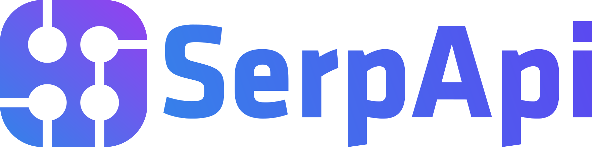

<p align="center"><picture><source media="(prefers-color-scheme: dark)" srcset="docs/wordmark-dark.svg"></picture></p>

<p align="center">Agent tìm việc bằng AI mã nguồn mở.</p>

<p align="center">
  <a href="README.md">English</a> |
  <a href="README.es.md">Español</a> |
  <a href="README.de.md">Deutsch</a> |
  <a href="README.fr.md">Français</a> |
  <a href="README.pt-BR.md">Português (Brasil)</a> |
  <a href="README.ko-KR.md">한국어</a> |
  <a href="README.ja.md">日本語</a> |
  <a href="README.cn.md">简体中文</a> |
  <a href="README.zh-TW.md">繁體中文</a> |
  <a href="README.ua.md">Українська</a> |
  <a href="README.ru.md">Русский</a> |
  <a href="README.pl.md">Polski</a> |
  <a href="README.da.md">Dansk</a> |
  <a href="README.ta.md">தமிழ்</a> |
  <a href="README.ar.md">العربية</a> |
  <a href="README.hi.md">हिन्दी</a> |
  <a href="README.tr.md">Türkçe</a> |
  <a href="README.vi.md">Tiếng Việt</a>
</p>

<!-- The non-breaking spaces (&nbsp;) and word joiners (&#8288;) below decide where each line wraps on a phone. Keep them when editing. -->

<p align="center"><a href="https://github.com/santifer"></a>&nbsp;&nbsp;<a href="https://github.com/santifer"><strong>santifer</strong></a></p>

<p align="center">
<strong>Nhiều tháng gửi CV vào&nbsp;im&nbsp;lặng.</strong><br>
Nên tôi tự xây bộ lọc mà tôi&nbsp;cần.
</p>

<p align="center">
<strong>740&nbsp;tin&nbsp;đã&nbsp;đánh&nbsp;giá. 68&nbsp;đơn&nbsp;ứng&nbsp;tuyển. 12&nbsp;buổi&nbsp;phỏng&nbsp;vấn.&nbsp;1&nbsp;offer.</strong><br>
Tôi là người dùng đầu tiên. Tôi nhận được&nbsp;việc. Rồi&nbsp;tôi&nbsp;mở&nbsp;mã&nbsp;nguồn&nbsp;nó.
</p>

<p align="center">
Dán một tin tuyển dụng. Ngay trên máy bạn, nó cho biết tin còn&nbsp;mở không và có&nbsp;hợp với bạn không.<br>
Nó điều chỉnh CV và soạn nháp&nbsp;câu&nbsp;trả&nbsp;lời. <strong>Bạn&nbsp;là&nbsp;người&nbsp;bấm&nbsp;Submit.</strong>
</p>

<p align="center">
  
</p>

<p align="center"><sub>Quá trình tìm việc của chính tôi, đang giữa chừng, với&nbsp;giao&nbsp;diện&nbsp;tiếng&nbsp;Tây&nbsp;Ban&nbsp;Nha.</sub></p>

<p align="center">
  Các công ty dùng AI để lọc ứng viên.<br>
  <strong>Tôi chỉ trao cho ứng viên AI&nbsp;để&nbsp;<em>chọn</em>&nbsp;công&nbsp;ty.</strong>
</p>

<p align="center">
  Sáu tháng sau, <strong>tôi rời công việc đó.</strong><br>
  Giờ chúng tôi xây career-ops, để&nbsp;bạn&nbsp;có&nbsp;được&nbsp;công&nbsp;việc&nbsp;của&nbsp;mình.
</p>

<p align="center"><a href="#đến-lượt-bạn">Thử với một tin&nbsp;↓</a> · <a href="https://santifer.io/career-ops-system">Đọc toàn bộ&nbsp;câu&nbsp;chuyện&nbsp;→</a></p>

<br>

<p align="center"><a href="HIRED.md"></a></p>

<p align="center">Những người đến sau tôi đã viết lại cách họ được tuyển.</p>

<p align="center">
  <a href="HIRED.md"></a>
</p>

<p align="center"><sub>Mỗi thẻ là một issue công khai bạn có thể mở. Đã có việc? <a href="https://github.com/career-ops-hq/career-ops/issues/new?template=i-got-hired.yml">Để lại thẻ của bạn →</a></sub></p>

<p align="center">⭐ <strong>Nếu career-ops giúp được bạn, một ngôi sao sẽ giúp người tiếp theo tìm thấy&nbsp;nó.</strong></p>

<br>

<p align="center">
  <a href="https://wired.com.gr/article/to-ai-ergaleio-pou-fernei-epanastasi-ston-tropo-pou-psachnoume-douleia/" rel="noopener noreferrer nofollow"><picture><source media="(prefers-color-scheme: dark)" srcset="docs/press/wired-dark.svg"></picture></a>
  &nbsp;&nbsp;&nbsp;&nbsp;
  <a href="https://www.businessinsider.com/how-i-built-tool-filter-job-listings-landed-head-ai-2026-4" rel="noopener noreferrer nofollow"><picture><source media="(prefers-color-scheme: dark)" srcset="docs/press/business-insider-dark.svg"></picture></a>
</p>

<p align="center">
  <a href="https://vercel.com/open-source-program"></a>
</p>

<p align="center">
  <a href="https://trendshift.io/repositories/25195" rel="noopener noreferrer"></a>
  &nbsp;&nbsp;&nbsp;&nbsp;
  <a href="https://www.producthunt.com/products/santifer-io?utm_source=badge-featured&utm_medium=badge" rel="noopener noreferrer"></a>
</p>

## Đến lượt bạn

Dán một tin bạn định ứng tuyển tối nay. Nếu kết quả là <em>đừng ứng tuyển</em>, bạn vừa lấy lại được buổi tối. Nếu kết quả là một kế hoạch, bạn biết phải làm gì tiếp theo.

```bash
npx @santifer/career-ops init
```

<p align="center"><sub>Mã nguồn mở. Chạy cục bộ. Ngay trong AI CLI bạn đang dùng. <a href="docs/RUNNING_ON_A_BUDGET.md">Gồm cả mô hình miễn phí và cục bộ.</a></sub></p>


## Bạn không cần tìm việc một mình

Sự im lặng sau khi bạn bấm gửi không phải lỗi của bạn. Đủ nhiều người đã thấy cùng một điều để viết lại thực hành này, trong sáu dòng:

> Ứng tuyển tốt hơn vào ít nơi hơn. Tín hiệu hơn số lượng. Bằng chứng hơn từ khóa. Con người quyết định. Ưu tiên cục bộ. Phẩm giá cho cả hai phía bàn tuyển dụng.

<p align="center"><a href="https://career-ops.org/manifesto?utm_source=readme"></a></p>

<p align="center">Vài người trong số họ, bằng lời của chính họ.</p>

<p align="center">
  <a href="https://career-ops.org/manifesto?utm_source=readme"></a>
</p>

<p align="center"><sub>Mỗi chữ ký là một commit bạn có thể kiểm chứng. <a href="https://career-ops.org/manifesto?utm_source=readme">Đọc tất cả, hoặc thêm chữ ký của bạn →</a></sub></p>

<br>

Việc tuyển dụng sẽ không tự sửa. Những người đang trải qua nó thì có thể, và họ đã ở trong phòng, trao đổi kinh nghiệm và sửa cấu hình cho nhau. [Đây là nơi bản sửa được viết ra](CONTRIBUTING.md). Một căn phòng, không phải một câu lạc bộ. **Hãy cùng xây dựng.**

<p align="center"><a href="https://discord.gg/8pRpHETxa4"></a></p>

## Nhà tài trợ

career-ops miễn phí cho ứng viên, mãi mãi. Các công ty sau tài trợ cho dự án:

<p align="center">
  <a href="https://serpapi.com/career-ops-org" title="SerpApi"></a>
</p>

<p align="center"><strong>SerpApi</strong> · Build a portfolio project with live search data. SerpApi gives developers structured JSON/Markdown from Google Search, Maps, Shopping, and other engines through a simple API call.</p>

> Tài trợ chỉ mua được sự hiển thị có gắn nhãn rõ ràng, không bao giờ mua được ảnh hưởng: không khoản tiền nào thay đổi lộ trình hay đặt bất cứ thứ gì vào sản phẩm. Nhà tài trợ không bao giờ xuất hiện trong đánh giá, xếp hạng hay đề xuất.

## career-ops làm gì cho bạn

Dán một tin tuyển dụng. Nó cho bạn biết buổi tối đó có đáng không.

- **Còn mở không?** Nó kiểm tra tin còn đang tuyển trước khi bạn viết một chữ.
- **Không hợp với bạn?** Nó chấm điểm vai trò dựa trên CV thật của bạn và khuyên bỏ qua những tin kém phù hợp. Bạn có thể quyết định khác.
- **Đáng không?** Nó soạn nháp CV, cover letter và các câu trả lời. Bạn đọc. Bạn gửi.
- **Nói chuyện với ai?** Nó tìm người phù hợp và soạn nháp tin nhắn. Nó không bao giờ gửi.
- **Mọi thứ nằm ở đâu?** Mọi đơn ứng tuyển ở lại trên máy bạn. Không gì được tải lên cho chúng tôi.
- **Nên học gì?** Sau một chuỗi bị từ chối, nó chỉ ra khoảng trống.

Những lần chạy đầu còn thô. Nó chưa biết bạn. Hãy trò chuyện với nó: CV của bạn, điều bạn muốn, điều bạn từ chối. Hãy coi đó là tuần đầu tiên của một recruiter.

Lần khởi động đầu tiên, nó hỏi tất cả những điều đó ngay trong cuộc trò chuyện. Không cần cấu hình thủ công.

## career-ops sẽ không làm gì

- **Tự động nộp đơn ứng tuyển.** Nó soạn nháp câu trả lời cho mọi ô; bạn xem lại và bấm Submit. Script không bao giờ POST (`prepare-application.mjs`).
- **Gửi email.** Chỉ soạn nháp. Không có thành phần gửi thư nào trong codebase này.
- **Gửi dữ liệu về máy chủ của chúng tôi.** Không telemetry, không backend của chúng tôi. CV của bạn đi từ máy bạn tới nhà cung cấp AI bạn chọn, và không đi đâu khác. Sổ cái công khai duy nhất là repo này: `HIRED.md` và các issue của nó.
- **Thúc bạn ứng tuyển khi điểm dưới 4.0/5.** Nó sẽ khuyên bạn đừng. Bạn có thể quyết định khác, và nó sẽ nói rõ điều đó.

Nó diễn đạt lại CV của bạn; nó không bao giờ được bịa ra. Một bước kiểm tra trong mã sẽ chặn PDF có số liệu hoặc thông tin không xuất hiện trong CV hay article digest của bạn, nhưng nó chưa thể đánh giá mọi cách diễn đạt lại. Hãy đọc từng CV trước khi gửi. Chi tiết trong [Câu hỏi thường gặp](#câu-hỏi-thường-gặp).

## Tính năng

| Tính năng                | Mô tả                                                                                                                                    |
| ------------------------ | ---------------------------------------------------------------------------------------------------------------------------------------- |
| **Đánh giá A-H**         | Tóm tắt vai trò, match với CV (kèm mức độ quan trọng của từng yêu cầu đối với tin này, và trọng số đó đến từ chính câu chữ của JD, cấu trúc của nó hay một ước lượng, được gắn nhãn cho từng yêu cầu; một ước lượng không bao giờ được xếp vào mức cao nhất), chiến lược level, nghiên cứu lương, cá nhân hóa, chuẩn bị phỏng vấn (STAR+R) -- cộng thêm kiểm tra độ tin cậy của tin ở Block G (tin còn mở không, có phải tin đăng lại không: quan sát, không phải phán quyết), và tín hiệu Work-Auth đánh dấu JD ghi rõ không bảo lãnh là blocker cứng |
| **Con người trong vòng lặp** | AI đánh giá và đề xuất, bạn quyết định và hành động. Hệ thống không bao giờ nộp đơn ứng tuyển -- bạn luôn là người quyết định cuối cùng <!-- hitl: absolute guarantee. Do not add "automatically", "by itself", "without your permission" or any other hedge when translating this row. --> |
| **Tạo PDF cho ATS**      | CV đọc được bởi ATS, điều chỉnh theo từng JD từ chính kinh nghiệm của bạn, thiết kế Space Grotesk + DM Sans |
| **Tạo Cover Letter**     | Cover letter có nghiên cứu, bám sát từ khóa của JD, bốn câu hỏi định hướng tương tác (vì sao/vấn đề/cách tiếp cận/giọng điệu), bước duyệt bản nháp ngay trong chat, và PDF A4 qua cùng pipeline HTML + Playwright như CV. Tự soạn nháp ở mỗi lần đánh giá; hoàn thiện và tạo theo yêu cầu qua `/career-ops cover` |
| **Vượt ra ngoài CV**     | Nghiên cứu công ty ([`deep`](modes/deep.md)) chỉ ra chiến lược AI, các động thái gần đây, văn hóa kỹ thuật và góc tiếp cận hồ sơ của bạn nên chọn. Tìm liên hệ ([`contacto`](modes/contacto.md)) xác định hiring manager, recruiter hoặc đồng nghiệp trong team đáng để tiếp cận và soạn nháp tin nhắn LinkedIn dưới 300 ký tự phù hợp với từng loại liên hệ. Soạn nháp email ứng tuyển chính thức ([`email`](modes/email.md)) biến một báo cáo đã đánh giá hoặc JD dán vào thành dòng tiêu đề, nội dung và danh sách tệp đính kèm mà không gửi, nộp hay bấm bất cứ thứ gì. Đơn ứng tuyển đưa bạn vào hàng đợi; nghiên cứu đưa bạn vào cuộc trò chuyện. |
| **Phân tích mẫu hình**   | Mẫu hình bị từ chối và tỷ lệ tiến tới bước sau theo từng kênh ATS (`analyze-patterns.mjs`), thống kê phễu toàn thời gian (`stats.mjs`), phát hiện tin đăng lại, dấu hiệu có thể của tin ma (`detect-reposts.mjs`) |

<details>
<summary><b>Mọi thứ khác nó làm được</b></summary>

| Tính năng                | Mô tả                                                                                                                                    |
| ------------------------ | ---------------------------------------------------------------------------------------------------------------------------------------- |
| **Auto-Pipeline**        | Dán một URL, nhận đánh giá đầy đủ + PDF + dòng tracker |
| **Kho câu chuyện phỏng vấn** | Tích lũy các câu chuyện STAR+Reflection qua các lần đánh giá -- 5-10 câu chuyện gốc bạn có thể điều chỉnh cho các câu hỏi hành vi |
| **Kịch bản đàm phán**    | Khung đàm phán lương, phản biện việc giảm lương theo địa lý, đòn bẩy từ offer cạnh tranh |
| **Nháp email ứng tuyển** | Email ứng tuyển chính thức tới recruiter/người giới thiệu/cold email từ một báo cáo hoặc JD dán vào, kèm dòng tiêu đề, danh sách tệp đính kèm, các điểm phù hợp có nguồn và khối liên hệ lấy từ hồ sơ. Chỉ soạn nháp -- career-ops không bao giờ gửi, nộp hay bấm bất cứ thứ gì. |
| **Scanner cổng việc làm** | 100+ công ty cấu hình sẵn (Anthropic, OpenAI, ElevenLabs, Retool, n8n...) + truy vấn tùy chỉnh trên Ashby, Greenhouse, Lever, Wellfound |
| **Khám phá công ty vừa gọi vốn** | Lệnh `company:funded` ưu tiên xem lại trước hiển thị các công ty vừa gọi vốn và chẩn đoán nguồn từ các feed công khai có cấu trúc mà không sửa dữ liệu của bạn |
| **Xử lý hàng loạt**      | Đánh giá song song với các worker CLI headless (`claude -p` / `opencode run`) |
| **Dashboard TUI**        | Giao diện terminal để duyệt, lọc và sắp xếp pipeline của bạn |
| **Toàn vẹn pipeline**    | Tự động merge, loại trùng, chuẩn hóa trạng thái, kiểm tra sức khỏe |
| **Bộ công cụ phỏng vấn** | Kế hoạch chuẩn bị theo khung giờ, buổi luyện tập có phản hồi, tổng kết sau phỏng vấn ([`interview/`](modes/interview/README.md)), và bộ phát hiện red flag của công ty ([`interview-redflag`](modes/interview-redflag.md)) |
| **Giai đoạn offer**      | Trợ lý đọc hợp đồng -- đi qua từng điều khoản kèm danh sách câu hỏi cho luật sư ([`offer-prep`](modes/offer-prep.md)) -- và bộ phân tích chênh lệch lương mong muốn/quảng cáo/thực tế (`salary-gap.mjs`) |
| **Follow-up và phản hồi** | Bộ tính nhịp follow-up và nhắc nhở gieo sẵn (`followup-cadence.mjs`, `followup-seed.mjs`); phân loại phản hồi của nhà tuyển dụng thành cập nhật tracker ([`reply-watch`](modes/reply-watch.md)) |
| **Hệ thống plugin**      | Tích hợp tùy chọn (Gmail, Notion, Apify + registry cộng đồng), tắt theo mặc định -- xem [docs/PLUGINS.md](docs/PLUGINS.md) |

</details>

## Bắt đầu nhanh

**Cách nhanh nhất, một lệnh:**

```bash
npx @santifer/career-ops init
```

> 💡 `npx` đi kèm [Node.js](https://nodejs.org): nó chạy trình cài đặt một lần,
> mà không cài gì ở cấp toàn cục. Chưa có Node? Hãy cài trước.
> (Đang dùng Claude Code / Gemini / Codex CLI? Vậy là bạn đã có sẵn.)

Lệnh này clone bản phát hành mới nhất vào `./career-ops` và cài các phụ thuộc. Sau đó:

```bash
cd career-ops
claude   # hoặc codex / qwen / opencode / agy / grok — mở AI CLI của bạn tại đây
```

**Ở lần khởi động đầu tiên, career-ops hướng dẫn bạn thiết lập (CV, hồ sơ và vai trò mục tiêu) chỉ bằng cách trò chuyện. Không cần sửa tay gì cả.**

<details>
<summary><b>Muốn tự cài thủ công? (git clone)</b></summary>

```bash
git clone https://github.com/career-ops-hq/career-ops.git
cd career-ops && npm install
npx playwright install chromium   # chỉ cần khi tạo PDF
# Trên bản phân phối Linux không phải Debian/Ubuntu (Fedora, Arch, ...), các thư viện
# hệ thống của Chromium không được cài bởi dòng trên — hãy tự cài bằng trình quản lý
# gói của bản phân phối nếu việc tạo PDF không mở được trình duyệt
# (tài liệu của Playwright liệt kê các thư viện cần thiết theo từng nền tảng).

# 2. Kiểm tra thiết lập
npm run doctor                     # Kiểm tra mọi điều kiện tiên quyết

# 3. Cấu hình
cp config/profile.example.yml config/profile.yml  # Sửa thành thông tin của bạn
cp templates/portals.example.yml portals.yml       # Tùy chỉnh danh sách công ty

# 4. Thêm CV của bạn
# Tạo cv.md ở thư mục gốc dự án với CV của bạn dạng markdown

# 5. Mở AI CLI của bạn trong thư mục này
claude   # hoặc codex / opencode / qwen / agy / grok

# Rồi nhờ CLI của bạn điều chỉnh hệ thống cho phù hợp với bạn:
# "Đổi các archetype sang các vai trò backend engineering"
# "Dịch các mode sang tiếng Việt"
# "Thêm 5 công ty này vào portals.yml"
# "Cập nhật hồ sơ của tôi bằng CV tôi đang dán"

# 6. Bắt đầu dùng
# Dán URL tin tuyển dụng hoặc văn bản JD để kích hoạt auto-pipeline
# Nếu CLI của bạn hỗ trợ slash command, dùng /career-ops (hoặc bí danh riêng của CLI đó)
# Trong Codex, hãy yêu cầu cùng mode đó bằng ngôn ngữ thường, ví dụ:
# "Run the career-ops scan mode"
# "Run the career-ops pipeline mode for data/pipeline.md"
# "Run the career-ops pdf mode for the latest evaluated role"
# "Run the career-ops tracker mode and summarize the current statuses"
```

</details>

### Quét qua proxy đi ra ngoài

`fetch()` thông thường của Node có thể bỏ qua `HTTP_PROXY`, `HTTPS_PROXY` và `NO_PROXY` trong một sandbox chỉ cho đi qua proxy. Các request của provider có thể dùng các biến này với `CAREER_OPS_TRUST_PROXY_EGRESS=1 node scan.mjs`. Cách này dùng một bộ điều phối proxy theo phạm vi request; các request không liên quan không bị ảnh hưởng, và các đích trong `NO_PROXY` vẫn dùng lớp bảo vệ địa chỉ riêng cục bộ.

Chỉ đặt cờ này **khi chính proxy được cấu hình đã chặn kết nối tới các địa chỉ riêng tư, loopback và metadata**. Khi proxy phân giải đích từ xa, career-ops không thể xác minh địa chỉ cuối cùng ở máy cục bộ; proxy phải tự thực thi phần đó của ranh giới SSRF. Nếu không có thiết lập tin cậy tường minh này, các request của provider giữ đường truyền trực tiếp bình thường và lỗi DNS sẽ nêu rõ thiết lập proxy cần có. URL proxy chứa thông tin đăng nhập phải dùng HTTPS; proxy HTTP không có thông tin đăng nhập vẫn được hỗ trợ. Cờ này yêu cầu Node.js 18.17 trở lên. Các bản cài hiện có vẫn giữ đường truyền trực tiếp sau khi cập nhật hệ thống; chỉ riêng biến môi trường proxy không bật nó. Trước khi bật cờ, chạy `npm install` trong thư mục career-ops để cài phụ thuộc `undici` được thêm vào. Nó chỉ được nạp cho request đã chọn tham gia và có proxy được cấu hình, nên quét trực tiếp vẫn chạy bình thường ngay cả khi phụ thuộc đó chưa được cài.

### Cài toàn cục

```bash
npm i -g @santifer/career-ops
```

Lệnh này cài binary `career-ops` ở cấp toàn cục để bạn chạy trực tiếp thay vì qua `npx`. Khác với `npx @santifer/career-ops init` (khởi tạo một thư mục dự án), cài toàn cục cho bạn một lệnh `career-ops` cố định dùng được ở bất cứ đâu trong terminal.

**Nên dùng cách nào?**
- `npx @santifer/career-ops init`: tốt nhất cho lần dùng đầu; tạo một thư mục dự án riêng.
- `npm i -g @santifer/career-ops`: tốt nhất khi bạn đã có thư mục dự án và muốn chạy trực tiếp các lệnh career-ops.

> **Hệ thống được thiết kế để chính AI coding CLI của bạn tùy chỉnh.** Mode, archetype, trọng số chấm điểm, kịch bản đàm phán -- chỉ cần nhờ nó thay đổi. Nó đọc chính những file nó dùng, nên biết chính xác cần sửa gì.

Xem [docs/SETUP.md](docs/SETUP.md) để có hướng dẫn thiết lập đầy đủ, [docs/RUNNING_ON_A_BUDGET.md](docs/RUNNING_ON_A_BUDGET.md) để chạy career-ops với chi phí thấp bằng mô hình tùy chỉnh hoặc cục bộ (và [docs/FREE_TIER.md](docs/FREE_TIER.md) để chạy với chi phí bằng không trên gói miễn phí của Antigravity CLI), [docs/AUTOMATION.md](docs/AUTOMATION.md) để lên lịch quét định kỳ và công thức phân loại tới shortlist không tốn token, [docs/APPLY_AUTOFILL.md](docs/APPLY_AUTOFILL.md) để biết chi tiết luồng tự điền ATS, [docs/LINKEDIN_JOIN.md](docs/LINKEDIN_JOIN.md) để đối chiếu bản xuất danh sách kết nối LinkedIn với các công ty trong phễu của bạn, và [docs/FAQ.md](docs/FAQ.md) cho câu trả lời về các câu hỏi thiết lập thường gặp, gồm cả [cách nguồn gốc câu chuyện ngăn việc bịa số liệu](docs/FAQ.md#why-does-career-ops-refuse-to-use-a-number-from-my-story-bank). Nguyên tắc thiết kế nằm ở [ARCHITECTURE.md](ARCHITECTURE.md); luồng chạy ở [docs/ARCHITECTURE.md](docs/ARCHITECTURE.md).

## Cách dùng

career-ops dùng một bộ định tuyến lệnh dùng chung. Trong các CLI đăng ký slash command, nó trông như sau:

```
/career-ops           → Hiện mọi lệnh có sẵn
/career-ops {JD}      → AUTO-PIPELINE: đánh giá + báo cáo + PDF + tracker (dán văn bản hoặc URL)
/career-ops pipeline  → Xử lý các URL đang chờ trong hộp thư (data/pipeline.md)
/career-ops oferta    → Chỉ đánh giá, các block A đến H (không tự tạo PDF)
/career-ops ofertas   → So sánh và xếp hạng nhiều offer
/career-ops contacto  → Nước đi mạnh trên LinkedIn: tìm liên hệ + soạn nháp tin nhắn
/career-ops deep      → Prompt nghiên cứu sâu về công ty
/career-ops interview-prep → Tạo tài liệu chuẩn bị phỏng vấn riêng cho công ty
/career-ops interview    → Buổi phỏng vấn tương tác để thiết lập hồ sơ/CV
/career-ops master-profile → Nhập, xem lại và xác thực Master Career Profile của bạn
/career-ops eu-swe    → Hiệu chỉnh một đơn ứng tuyển SWE châu Âu trước CV/apply/phỏng vấn
/career-ops interview/plan → Kế hoạch chuẩn bị theo khung giờ cho buổi phỏng vấn sắp tới
/career-ops interview/practice → Phỏng vấn thử, từng câu một kèm phản hồi
/career-ops interview/debrief → Tổng kết sau phỏng vấn: lấp khoảng trống, dự đoán vòng sau
/career-ops interview-redflag → Phân tích dấu hiệu cảnh báo của nhà tuyển dụng trước khi gia nhập
/career-ops pdf       → Chỉ PDF, CV tối ưu cho ATS
/career-ops text      → CV markdown đã điều chỉnh (phản chiếu cv.md, không PDF)
/career-ops latex     → Xuất CV dạng LaTeX/Overleaf .tex
/career-ops latex-tex → Điều chỉnh trực tiếp resume.tex của riêng bạn (tùy chọn; cv.md vẫn là mặc định)
/career-ops cover     → Cover letter: dán JD độc lập hoặc /career-ops cover {slug}
/career-ops email     → Nháp email ứng tuyển chính thức (chỉ nháp; không bao giờ gửi, nộp hay bấm)
/career-ops add       → Thêm dự án/bài báo/vai trò vào CV (lấy + xem trước + xác nhận)
/career-ops expand    → Tự phát hiện và thêm các năng lực còn thiếu từ liên kết hồ sơ
/career-ops training  → Đánh giá khóa học/chứng chỉ so với North Star
/career-ops project   → Đánh giá ý tưởng dự án portfolio
/career-ops tracker   → Tổng quan trạng thái ứng tuyển
/career-ops agent-inbox → Xếp hàng/xử lý yêu cầu cho phiên sau (data/agent-inbox.md)
/career-ops apply     → Trợ lý ứng tuyển trực tiếp (đọc form + tạo câu trả lời)
/career-ops scan      → Quét các cổng và tìm tin mới
/career-ops discover  → Chuyển danh sách công ty thành bảng ATS quét được + thêm vào portals.yml (không tốn token)
/career-ops batch     → Xử lý hàng loạt với worker song song
/career-ops patterns  → Phân tích mẫu hình bị từ chối và cải thiện mục tiêu
/career-ops offer-prep → Cùng ứng viên đọc offer/hợp đồng nhận được: đi qua điều khoản + câu hỏi cho luật sư (không phải tư vấn pháp lý)
/career-ops titles    → Gợi ý các chức danh lân cận từ CV để mở rộng tìm kiếm
/career-ops upskill   → Tổng hợp phân tích khoảng trống kỹ năng từ các báo cáo đã đánh giá
/career-ops followup  → Theo dõi nhịp follow-up: đánh dấu quá hạn, tạo bản nháp
/career-ops reply-watch → Phân loại phản hồi của nhà tuyển dụng và gợi ý cập nhật tracker
/career-ops outcome   → Ghi kết quả ứng tuyển và lưu trữ các tài liệu
/career-ops calibrate → Báo cáo tham vấn: điểm đánh giá có dự đoán đúng kết quả thật của bạn không? Đọc dữ liệu /outcome; không bao giờ thay đổi cách chấm điểm
/career-ops update    → Cập nhật file hệ thống career-ops với xem trước diff + kiểm tra tương thích
```

Hoặc chỉ cần dán thẳng URL hay mô tả tin tuyển dụng -- career-ops tự nhận diện và chạy toàn bộ pipeline.

Trong Codex, slash command không được đảm bảo. Hãy dùng cùng tên mode trong prompt, hoặc gọi chúng từ `codex exec`.

## Cách hoạt động

```
Bạn dán URL hoặc mô tả tin tuyển dụng
        │
        ▼
┌──────────────────┐
│  Archetype       │  Phân loại: LLMOps / Agentic / PM / SA / FDE / Transformation
│  Detection       │
└────────┬─────────┘
         │
┌────────▼─────────┐
│  A-H Evaluation  │  Match, khoảng trống, nghiên cứu lương, câu chuyện STAR, độ tin cậy
│  (reads cv.md)   │
└────────┬─────────┘
         │
    ┌────┼────┐
    ▼    ▼    ▼
 Report  PDF  Tracker
  .md   .pdf  entry
```

## Tích hợp Antigravity CLI

career-ops hỗ trợ Antigravity CLI một cách tự nhiên, giống như hỗ trợ Claude Code và OpenCode. Mọi slash command đều dùng được qua điểm vào skill dùng chung, với cùng logic đánh giá trong `modes/*.md`.

Google đã chuyển quyền truy cập Gemini CLI dành cho người dùng cá nhân sang Antigravity CLI. `GEMINI.md` hiện là một lớp bảo vệ tương thích không làm gì, để Antigravity không nhân đôi toàn bộ hướng dẫn dự án khi đọc cả `AGENTS.md` và `GEMINI.md`.

### Antigravity CLI gốc

```bash
# 1. Chạy trong thư mục career-ops
cd career-ops
agy

# 2. Dùng lệnh /career-ops thống nhất với các lệnh con:
/career-ops "Senior AI Engineer at Anthropic..."
/career-ops pipeline
/career-ops scan
/career-ops pdf
/career-ops tracker
```

Skill được định nghĩa theo chuẩn mở trong `.agents/skills/career-ops/SKILL.md` và được symlink/tham chiếu cho từng CLI được hỗ trợ (ví dụ `.claude/`, `.cursor/`, `.qwen/`, `.antigravitycli/`, `.grok/`).

## Tích hợp Codex

career-ops hỗ trợ Codex qua cùng bộ định tuyến dùng chung, nhưng cách gọi khác với các CLI tự đăng ký slash command. Xem hướng dẫn đầy đủ tại [docs/CODEX.md](docs/CODEX.md).

### Codex tương tác

```bash
cd career-ops
codex
```

Slash command không được đảm bảo trong Codex. Nếu `/career-ops` không có, hãy nhờ Codex chạy mode trực tiếp bằng ngôn ngữ thường:

```text
Evaluate this JD with career-ops auto-pipeline: https://company.com/jobs/123
Run the career-ops scan mode and summarize new matches.
Run the career-ops pipeline mode for data/pipeline.md.
Run the career-ops pdf mode for the latest evaluated role.
Run the career-ops tracker mode and summarize the current statuses.
```

### Codex một lần (`codex exec`)

```bash
codex exec "Evaluate this JD with career-ops auto-pipeline: https://company.com/jobs/123"
codex exec "Run career-ops scan mode in this repo and summarize new matches."
codex exec "Run career-ops pipeline mode for data/pipeline.md."
codex exec "Run career-ops pdf mode for the latest evaluated role."
codex exec "Run career-ops tracker mode and summarize the current statuses."
```

## Tích hợp Grok Build CLI

career-ops hỗ trợ Grok Build CLI một cách tự nhiên, giống như hỗ trợ Claude Code và OpenCode. `AGENTS.md` được tự động nạp làm quy tắc dự án, và mọi slash command đều dùng được qua điểm vào skill dùng chung.

### Grok Build CLI gốc

```bash
# 1. Chạy trong thư mục career-ops
cd career-ops
grok

# 2. Dùng lệnh /career-ops thống nhất với các lệnh con:
/career-ops "Senior AI Engineer at Anthropic..."
/career-ops pipeline
/career-ops scan
/career-ops pdf
/career-ops tracker
```

Với worker batch headless, dùng `grok -p "prompt"` (thêm `--yolo` để tự động chấp thuận việc chạy công cụ).

## Tích hợp Pi

career-ops hỗ trợ [Pi](https://github.com/earendil-works/pi) một cách tự nhiên, không có file bọc nào cần bảo trì: Pi đọc `AGENTS.md` ở thư mục gốc repo làm ngữ cảnh dự án và tự tìm skill dùng chung tại `.agents/skills/career-ops/SKILL.md`. Khi đó bộ định tuyến dùng được dưới dạng `/skill:career-ops`.

### Pi gốc

```bash
# 1. Chạy trong thư mục career-ops
cd career-ops
pi

# 2. Dùng skill dùng chung với các lệnh con:
/skill:career-ops "Senior AI Engineer at Anthropic..."
/skill:career-ops pipeline
/skill:career-ops scan
/skill:career-ops pdf
/skill:career-ops tracker
```

### Pi một lần (`pi -p`)

```bash
pi -p "Evaluate this JD with career-ops auto-pipeline: https://company.com/jobs/123"
pi -p "Run career-ops scan mode and summarize new matches."
pi -p "Run career-ops tracker mode and summarize the current statuses."
```

Nếu một bản Pi chặn tài nguyên dự án sau một quyết định tin cậy, hãy chạy `/trust` một lần trong repo rồi khởi động lại `pi` để skill của dự án được nạp (`/trust` áp dụng cho các tiến trình Pi sau này), hoặc khởi động với `-a`, tin cậy cho đúng một lần chạy và không cần khởi động lại.

### Script Gemini API độc lập (không cần cài CLI)

```bash
# 1. Lấy API key miễn phí tại https://aistudio.google.com/apikey
cp .env.example .env
# Sửa .env, đặt GEMINI_API_KEY=your_key_here

# 2. Cài các phụ thuộc
npm install

# 3. Đánh giá một mô tả công việc
node gemini-eval.mjs "We are looking for a Senior AI Engineer..."
node gemini-eval.mjs --file ./jds/my-job.txt
node agent-inbox.mjs add "..."   # xếp hàng một yêu cầu cho phiên sau
npm run gemini:eval -- "JD text here"
```

> **Gói miễn phí:** Cả hai cách đều chạy được mà không cần thanh toán. CLI gốc dùng Google OAuth; script API dùng `gemini-3.6-flash` (giới hạn tốc độ phụ thuộc mô hình và gói; xem tài liệu Google AI để biết hạn mức hiện tại).

## Các cổng đã cấu hình sẵn

Scanner đi kèm **100+ công ty** sẵn sàng quét và **35+ truy vấn tìm kiếm** trên các cổng việc làm lớn. Sao chép `templates/portals.example.yml` thành `portals.yml` và thêm của riêng bạn:

**Phòng thí nghiệm AI:** Anthropic, OpenAI, Mistral, Cohere, LangChain, Pinecone
**AI giọng nói:** ElevenLabs, PolyAI, Parloa, Hume AI, Deepgram, Vapi, Bland AI
**Nền tảng AI:** Retool, Airtable, Vercel, Temporal, Glean, Arize AI
**Contact Center:** Ada, LivePerson, Sierra, Decagon, Talkdesk, Genesys
**Doanh nghiệp:** Salesforce, Twilio, Gong, Dialpad
**LLMOps:** Langfuse, Weights & Biases, Lindy, Cognigy, Speechmatics
**Tự động hóa:** n8n, Zapier, Make.com
**Châu Âu:** Factorial, Attio, Tinybird, Clarity AI, Travelperk

**Cổng việc làm được tìm:** 55+ module provider bao phủ API của ATS, feed toàn cổng, feed XML/RSS, feed markdown và bộ phân tích cục bộ. Xem [Các cổng việc làm được hỗ trợ](docs/SUPPORTED_JOB_BOARDS.md) để có bảng đầy đủ.

Theo mặc định `node scan.mjs` (hay `npm run scan`) tin vào những gì mỗi feed ATS trả về. Một số công ty để lại tin cũ trong API công khai ngay cả sau khi vai trò đã đóng, nên các mục hết hạn đó có thể lọt vào `pipeline.md`. Truyền `--verify` để khởi chạy Playwright sau lượt API và loại bỏ tin hết hạn trước khi chúng vào pipeline:

```bash
node scan.mjs --verify          # khám phá không tốn token + kiểm tra còn mở bằng Playwright
```

Việc xác minh chạy tuần tự và chỉ áp dụng cho tin mới (sau khi loại trùng), nên chi phí luôn có giới hạn.

## Dashboard TUI

Dashboard terminal tích hợp cho phép bạn duyệt pipeline một cách trực quan:

```bash
npm run serve:dashboard   # chạy TUI
npm run build:dashboard   # tùy chọn: build binary độc lập
```

Tính năng: 6 tab lọc, 4 kiểu sắp xếp, chế độ nhóm/phẳng, xem trước tải lười, đổi trạng thái ngay trong danh sách.

Ngoài ra còn có một **giao diện web thử nghiệm** (alpha và tùy chọn: không gì chạy trừ khi bạn khởi động): xem [`web/README.md`](web/README.md).

## Cấu trúc dự án

```
career-ops/
├── AGENTS.md                    # Hướng dẫn agent chuẩn (mọi CLI)
├── CLAUDE.md                    # Lớp bọc cho Claude Code (import AGENTS.md)
├── CODEX.md                     # Lớp bọc cho Codex (import AGENTS.md)
├── OPENCODE.md                  # Lớp bọc cho OpenCode (import AGENTS.md)
├── GEMINI.md                    # Lớp bảo vệ cũ không làm gì, tránh Antigravity nhân đôi ngữ cảnh
├── cv.md                        # CV của bạn (tự tạo)
├── article-digest.md            # Các proof point của bạn (tùy chọn)
├── config/
│   └── profile.example.yml      # Mẫu hồ sơ của bạn
├── modes/                       # Các skill mode
│   ├── _shared.md               # Ngữ cảnh dùng chung (tùy chỉnh file này)
│   ├── oferta.md                # Đánh giá một tin
│   ├── pdf.md                   # Tạo PDF
│   ├── cover.md                 # Tạo cover letter
│   ├── email.md                 # Soạn nháp email ứng tuyển chính thức
│   ├── scan.md                  # Scanner cổng việc làm
│   ├── batch.md                 # Xử lý hàng loạt
│   └── ...
├── templates/
│   ├── cv-template.html         # Mẫu CV tối ưu cho ATS
│   ├── portals.example.yml      # Mẫu cấu hình scanner
│   └── states.yml               # Các trạng thái chuẩn
├── batch/
│   ├── batch-prompt.md          # Prompt worker tự chứa
│   └── batch-runner.sh          # Script điều phối
├── dashboard/                   # Trình xem pipeline TUI bằng Go
├── data/                        # Dữ liệu theo dõi của bạn (gitignored)
├── reports/                     # Báo cáo đánh giá (gitignored)
├── output/                      # PDF đã tạo (gitignored)
├── fonts/                       # Space Grotesk + DM Sans
├── docs/                        # Thiết lập, tùy chỉnh, hướng dẫn tiết kiệm, kiến trúc
└── examples/                    # CV, báo cáo, proof point mẫu
```

## Thư mục dữ liệu bên ngoài (tùy chọn)

Theo mặc định, dữ liệu lớp người dùng (như `cv.md`, `portals.yml` và các thư mục `data/` / `reports/` / `output/`) nằm trong thư mục gốc dự án.

Để tách dữ liệu cá nhân khỏi mã (giúp dễ đổi nhánh, kéo bản cập nhật hoặc thử nhiều hồ sơ), bạn có thể cấu hình một thư mục dữ liệu bên ngoài theo thứ tự ưu tiên sau:

1. **Biến môi trường:** Đặt biến môi trường `CAREER_OPS_ROOT` hoặc `CAREER_OPS_DATA_DIR`:
   ```bash
   export CAREER_OPS_ROOT=~/my-career-data
   ```
2. **File đánh dấu:** Tạo file `.career-ops-data` ở thư mục gốc repo chứa đường dẫn tới thư mục dữ liệu của bạn.
3. **Mặc định:** Mặc định là thư mục gốc repo.

Sau khi xác định xong, mọi file người dùng được đọc và ghi tương đối với thư mục đó, trong khi các file prompt và script tiếp tục được xác định tương đối với repo.

- **Ghi đè tracker:** Bạn cũng có thể đặt `CAREER_OPS_TRACKER` để ghi đè trực tiếp đường dẫn file tracker đơn ứng tuyển.
- **Ghi:** Mọi thao tác ghi (như merge) mặc định nhắm tới `{DATA_ROOT}/data/applications.md`.
- **Cấu hình scanner:** `portals.yml` được đọc và kiểm tra tại `{DATA_ROOT}/portals.yml`, nên `node validate-portals.mjs` kiểm tra đúng file mà `scan.mjs` đọc.
- **Tài liệu được tạo:** CV và cover letter đã điều chỉnh được ghi dưới `{DATA_ROOT}/output/`, và manifest PDF liên kết chúng với một báo cáo nằm ở `{DATA_ROOT}/data/pdf-index.tsv`. Khi `CAREER_OPS_TRACKER` chưa đặt, workspace tracker giới hạn các lần ghi đó là thư mục dữ liệu, không phải thư mục checkout.
- **PDF khi ghi đè tracker:** `generate-pdf.mjs` xác định `CAREER_OPS_TRACKER` trước khi suy ra workspace, nên khi có ghi đè, workspace là thư mục chứa tracker đó (hoặc thư mục cha của nó, khi tracker nằm trong thư mục `data/`). Khi đó HTML của CV và mọi PDF phải nằm trong workspace này, và manifest chuyển sang `data/pdf-index.tsv` của nó. Cover letter vẫn nhắm tới `{DATA_ROOT}/output/`, nên bị từ chối khi thư mục đó nằm ngoài workspace của tracker.
- **Lớp mã giữ nguyên chỗ:** `node_modules/`, `providers/`, `modes/` và chính các script luôn được xác định theo repo, không bao giờ theo thư mục dữ liệu.

TUI dashboard viết bằng Go, các script Node.js và các mode của AI agent đều tự động tuân theo thứ tự ưu tiên này.


## Công nghệ


- **Agent**: AI coding CLI với skill và mode dùng chung (`AGENTS.md` + lớp bọc CLI)
- **PDF**: Playwright + mẫu HTML
- **Cover letter**: mẫu HTML + Playwright (PDF A4, cùng pipeline với CV)
- **Scanner**: Playwright + Greenhouse API + WebSearch
- **Dashboard**: Go + Bubble Tea + Lipgloss (giao diện Catppuccin Mocha)
- **Dữ liệu**: bảng Markdown + cấu hình YAML + file batch TSV

<p align="center">
  <a href="https://github.com/career-ops-hq/career-ops/releases/latest"></a>
</p>

<p align="center">
  <a href="https://claude.com/claude-code"></a>
</p>

<p align="center">
  <sub>Cũng chạy trên mọi CLI theo chuẩn agent-skill. Xem <a href="docs/SUPPORTED_CLIS.md">Các CLI được hỗ trợ</a>.</sub><br>
  
  
  
  
  
  
  
  
  
  <br>
  
  
  
  
  
  <a href="TRADEMARK.md"></a>
</p>

## Cũng là mã nguồn mở

- **[cv-santiago](https://github.com/santifer/cv-santiago)** -- Website portfolio (santifer.io) với chatbot AI, dashboard LLMOps và các case study. Nếu bạn cần một portfolio để giới thiệu song song với việc tìm việc, hãy fork và biến nó thành của bạn.

## Câu hỏi thường gặp

**career-ops là gì?**
career-ops ([career-ops.org](https://career-ops.org), còn gọi là **careerops**) là công cụ tìm việc bằng AI mã nguồn mở chạy cục bộ trong AI coding CLI của bạn (Claude Code, Codex, OpenCode và các CLI khác) và để mọi quyết định cho bạn. Nó đánh giá tin tuyển dụng dựa trên CV của bạn, tạo PDF điều chỉnh cho ATS, tìm đúng người để liên hệ và theo dõi mọi thứ ở một nơi: bạn luôn là người quyết định cuối cùng. Đây là bản triển khai tham chiếu đầu tiên của [Tuyên ngôn CareerOps](https://career-ops.org/manifesto).

**CV đã điều chỉnh có thể bịa ra thông tin không?**
Không được phép, và các prompt đã nói rõ: diễn đạt lại, không bao giờ bịa. `generate-pdf` chặn CV có số liệu hoặc thông tin không có trong nguồn của bạn, trừ khi bạn truyền `--skip-fact-check`. Nó chưa kiểm tra chức danh hay đánh giá cách diễn đạt lại. Hai issue đang mở theo dõi việc này: [#2677](https://github.com/career-ops-hq/career-ops/issues/2677) (chức danh phải khớp cv.md) và [#1411](https://github.com/career-ops-hq/career-ops/issues/1411) (kiểm tra tính trung thực theo hướng chặn khi lỗi). Cho đến khi chúng được merge, hãy đọc từng CV trước khi gửi. [Tuyên bố miễn trừ pháp lý](LEGAL_DISCLAIMER.md) nói điều tương tự bằng lời dài hơn.

**Tôi có thể chạy career-ops miễn phí, hoặc trên mô hình rẻ hơn / cục bộ không?**
Được. career-ops không phụ thuộc CLI và chạy được trên mô hình miễn phí và cục bộ (mô hình miễn phí của OpenRouter, Ollama hoặc bất kỳ endpoint tương thích OpenAI nào), nên bạn không bị ràng buộc với gói trả phí. Xem [docs/RUNNING_ON_A_BUDGET.md](docs/RUNNING_ON_A_BUDGET.md) để biết cách thiết lập đầy đủ.

**Tôi trả phí Claude Pro/Max nhưng career-ops lại đang tiêu tín dụng API. Vì sao?**
Vì `ANTHROPIC_API_KEY` trong môi trường của bạn được ưu tiên hơn gói đăng ký đã đăng nhập: CLI dùng key và tính phí theo token. Chạy `echo $ANTHROPIC_API_KEY`, và nếu nó in ra bất cứ thứ gì, hãy xóa khỏi shell profile, khởi động lại terminal và chạy `/login`. Chế độ batch là ngoại lệ, vì worker `claude -p` không dùng đăng nhập tương tác: chạy `claude setup-token` một lần và export kết quả thành `CLAUDE_CODE_OAUTH_TOKEN`. Hướng dẫn đầy đủ trong [docs/RUNNING_ON_A_BUDGET.md](docs/RUNNING_ON_A_BUDGET.md#2b-already-paying-for-a-subscription-make-sure-you-are-using-it).

**career-ops chạy với những AI CLI nào?**
career-ops chạy trên mọi AI coding CLI lớn (Claude Code, Codex, Gemini / Antigravity, OpenCode, Grok, Qwen và nhiều CLI khác) thông qua chuẩn mở Agent Skill Standard, nên không bao giờ bị khóa vào một nhà cung cấp. Hãy dùng CLI bạn đã có.

**Cài career-ops trên Windows thế nào?**
career-ops chạy được trên Windows. Thiết lập riêng cho nền tảng và các điểm dễ vấp (tìm Git Bash, ký tự xuống dòng, Task Scheduler) nằm trong [docs/WINDOWS.md](docs/WINDOWS.md). Nếu skill không nạp được do lỗi symlink khi cài, cách sửa nằm trong [docs/FAQ.md](docs/FAQ.md). Các bước đầy đủ có trong [docs/SETUP.md](docs/SETUP.md).

**career-ops có tự động ứng tuyển thay tôi không?**
Không. career-ops là một bộ lọc, không phải công cụ tự ứng tuyển hàng loạt. AI đánh giá, xếp hạng và soạn nháp; bạn xem lại và quyết định. Nó soạn và điền; nó không bao giờ nộp. Bạn bấm Submit. Thiết kế có con người trong vòng lặp đó chính là cốt lõi.

**career-ops có miễn phí và mã nguồn mở không?**
Có. career-ops miễn phí và mã nguồn mở, và với ứng viên thì sẽ luôn như vậy. Đây là bản triển khai tham chiếu đầu tiên của [Tuyên ngôn CareerOps](https://career-ops.org/manifesto). Hãy đọc, và nếu nó nói đúng điều bạn tin, hãy ký.

## Về tác giả

Tôi là [Santiago Fernández de Valderrama Aparicio](https://santifer.io/about) (santifer), một cựu founder: tôi đã xây dựng và bán một doanh nghiệp vẫn đang vận hành với tên tôi. Tôi xây career-ops để quản lý việc tìm việc của chính mình, và nó hiệu quả: nó giúp tôi có được vị trí Head of Applied AI. Sáu tháng sau tôi rời vị trí đó để toàn thời gian xây dựng career-ops.

Tò mò một repo cỡ này được duy trì thế nào với một đội AI agent và một con người quyết định từng lần merge? Đọc [Agentic maintenance: how career-ops is run by a fleet of AI agents](https://santifer.io/ai-agent-fleet).

Portfolio và các dự án mã nguồn mở khác của tôi → [santifer.io](https://santifer.io)

Wikidata: [Santiago Fernández de Valderrama Aparicio](https://www.wikidata.org/wiki/Q138710224) · [career-ops](https://www.wikidata.org/wiki/Q139007988).

## Miễn trừ trách nhiệm

**career-ops là một công cụ cục bộ, mã nguồn mở, KHÔNG phải dịch vụ được lưu trữ.** Khi dùng phần mềm này, bạn thừa nhận:

1. **Bạn kiểm soát dữ liệu của mình.** CV, thông tin liên hệ và dữ liệu cá nhân của bạn ở lại trên máy bạn và được gửi trực tiếp tới nhà cung cấp AI bạn chọn (Anthropic, OpenAI, v.v.). Chúng tôi không thu thập, lưu trữ hay truy cập bất kỳ dữ liệu nào của bạn.
2. **Bạn kiểm soát AI.** Các prompt mặc định yêu cầu AI không tự động nộp đơn, nhưng mô hình AI có thể hành xử khó đoán. Nếu bạn sửa prompt hoặc dùng mô hình khác, bạn tự chịu rủi ro. **Luôn xem lại nội dung do AI tạo ra để đảm bảo chính xác trước khi nộp.**
3. **Bạn tuân thủ điều khoản dịch vụ của bên thứ ba.** Bạn phải dùng công cụ này theo Điều khoản dịch vụ của các cổng việc làm bạn tương tác (Greenhouse, Lever, Workday, LinkedIn, v.v.). Không dùng công cụ này để spam nhà tuyển dụng hay làm quá tải hệ thống ATS.
4. **Không có đảm bảo.** Đánh giá là khuyến nghị, không phải sự thật. Mô hình AI có thể bịa ra kỹ năng hoặc kinh nghiệm. Các tác giả không chịu trách nhiệm về kết quả việc làm, đơn bị từ chối, hạn chế tài khoản hay bất kỳ hậu quả nào khác.

Xem [LEGAL_DISCLAIMER.md](LEGAL_DISCLAIMER.md) để biết chi tiết. Phần mềm này được cung cấp theo [Giấy phép MIT](LICENSE) "nguyên trạng", không kèm bất kỳ bảo hành nào.

## Người đóng góp

<a href="https://github.com/career-ops-hq/career-ops/graphs/contributors">
  
</a>

Mọi người đã đóng góp mã, tài liệu, bản dịch hoặc test đều được liệt kê trong
[CONTRIBUTORS.md](CONTRIBUTORS.md), gồm cả các đóng góp không phải mã, thứ mà
biểu đồ ở trên không thể hiển thị.

Đã được tuyển nhờ career-ops? [Chia sẻ câu chuyện của bạn!](https://github.com/career-ops-hq/career-ops/issues/new?template=i-got-hired.yml)

## Giấy phép và nhãn hiệu

Mã được cấp phép theo [MIT](LICENSE). Tên và thương hiệu "career-ops"
được điều chỉnh bởi [Chính sách nhãn hiệu](TRADEMARK.md), thoáng với
cộng đồng, bảo lưu cho việc đặt tên sản phẩm thương mại và
bảo chứng.

## Lịch sử sao

<p align="center">
  <a href="https://warpchart.dev/hq">
    <picture>
      <source media="(prefers-color-scheme: dark)" srcset="https://warpchart.dev/api/chart?theme=dark&v=3">
      
    </picture>
  </a>
</p>

<p align="center"><sub>Được tạo và duy trì bởi <a href="https://santifer.io">Santiago Fernández de Valderrama Aparicio</a> (<a href="https://github.com/santifer">@santifer</a>)</sub></p>

## Kết nối

[](https://santifer.io)
[](https://linkedin.com/in/santifer)
[](https://x.com/santifer)
[](https://discord.gg/8pRpHETxa4)
[](mailto:hi@santifer.io)
